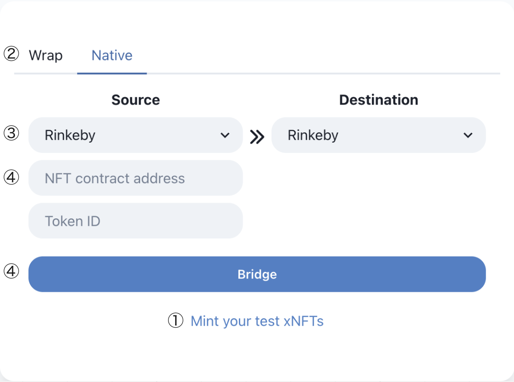

# How to use Native Bridge

****

Native Pattern is an extended contract that allows you to bridge between each chain by incorporating our contract into your NFT. When you burn an NFT in Chain A, the NFT is minted in Chain B. When you burn the NFT in Chain B, the NFT is minted in Chain A vice versa.

1. Minting test NFT with bridge function
2. Select Bridge Pattern
3. Select the origin chain and the destination chain
4. Input the NFT contract address on the origin chain and Input token ID
5. Click “Bridge” and send the transaction from your wallet.

If you want to deploy and use NFT with bridge function by yourself, please refer to Document [http://docs.nfthashi.com/](http://docs.nfthashi.com/)

See the next documentation and check how to check bridge status

[Next - How to check NFT bridge status](https://app.gitbook.com/o/-MYcZuSaxXsqK9KwuDwj/s/jt6Fy23jaZg0jRJETYkk/\~/changes/I6Qcq1BlfcvFhwzd296h/operation-guide/how-to-check-nft-bridge-status)
